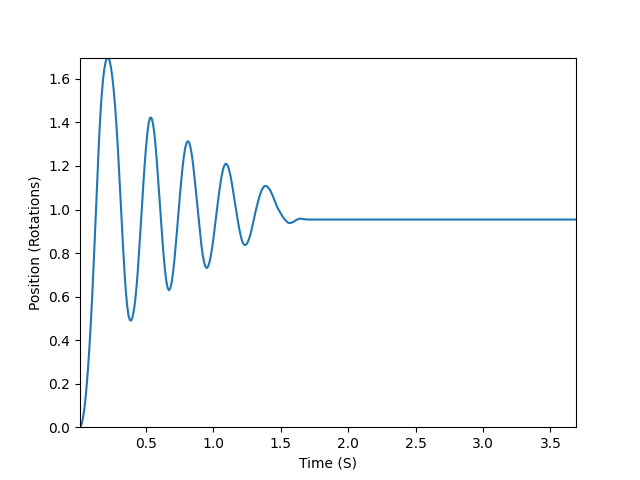
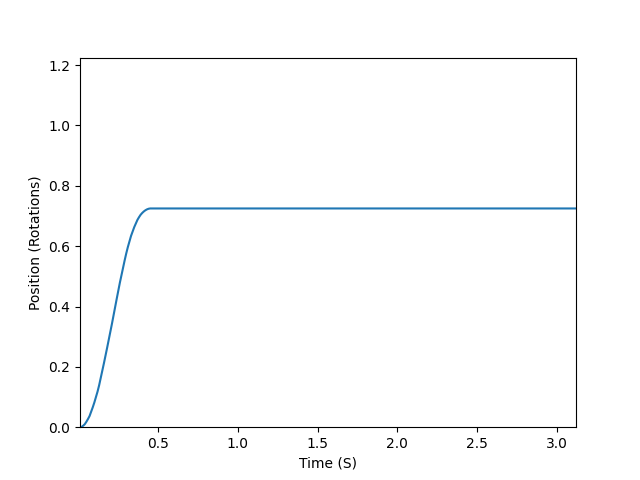
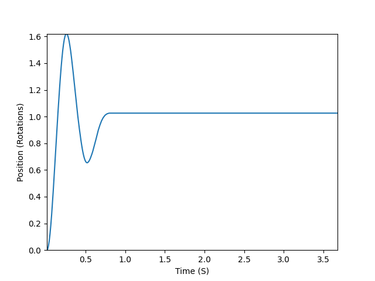

# ME-405-lab2
## ME 405 Lab 2: Out of Control

### Brief Summary
This README is for the ME-405-lab2 repository. This projects goal was to integrate the encoder reader and motor driver from lab one into a modular motor controller system. This was then integrated with the main which enables our micro controller to recieve and send data to a debugging compiuter. The debugging computer should be running the motor decoder program in order to send and recieve data. Once the data is recieved the motor decoder uses matplot lib to plot the resulting position and tim data from the motor.

---

### Operation

1. Activate the Microcontroller **Main** program through a connected debugging computer conencted by the Shoe link
2. Activate the **Motor Decoder** program on the seperate computer connected by the ST-Link
3. Input Parameters
4. Let program run as long as you wish
5. **Use Keyboard interrupt on the debugging computer in order to stop the program**
6. After the program is stopped, the decoder will wait for its 4 second time out before it plots the data it accumulated

---

# Detailed Information
This section contains detailed information on specific programs and aspects of the system.
## Motor Controller

### Encoder and Motor Drivers
The motor controller program seeks to integrate our previous itterations of encoder driver and motor driver to work in synergy and allow precise controll of any motor. Since both are class objects all relevant data is already stored within them such as the encoder position or the pwm input. This made integrating them convient as we did need any share variables. The primary change that occured within the previous code was removing the sampling timer within the encoder and making it run on the same timer that updates the motor. This was chosen as a design deicsion to avoid timing conflicts and reduce complexity.

### Motor Controller Integration
Using the encoder driver to get a live position, the motor controller compiles the error from the current position to the set position and scales the pwm input into motor driver by a *Kp* value. The *Kp* value depends on the motor and more data on the characteristics of *Kp* are provided in the **Mechanical Performance Data** section. The motor controller object which runs a specific motor is created in main. In this case the default motor created in main is Motor B and is corresponding encoder and driver information. 

## Main 
Main handles the creation of the motor object and the micro controller taking in and live streaming of data to a seperate computer through its ST-Link. This is done by initializing its UART channel twice. The first time is to recieve data from the computer, specifically the user input for *Kp*  the the motors *setpoint in ticks*. For the sake of the lab the *setpoint* should be 1000 ticks, however our program is configured to take in any set point.  The second initialization of UART is used to stream position and time data from the motor controller to the debugging computer for decoding and processing.

## Motor Decoder
The decoder handles all user input, sends it through its open serial port to the microcontroller and then also recieves live streamed data from the motor controller. Similarly to the main program, the decoder initializes its serial port twice. The first time the serial port is openned is to get user input for *Kp* and *setpoint in ticks* and send it to the micro controller. The port is then closed and opened again in order to start recieveing the live stream of data from the motor controller. Once the decoder receives an end singal upon the ending *See step 5 of operation* of the motor controller program the decoder parses the data and plots it.

## Mechanical Performance Data 
In order to properly document the motor controlelr various step responses where tested to see how the motor would respond under our controller. In order to ensure our motor controller operated as expected, an Underdamped, Overdamped and a "Perfectly Damped" *Kp*s where found.

This response shows an underdamped system where the Kp was too large and caused the system to over correct and therefore over shoot its target, which increases its time to reach steady state.

This response shows an overdamped system where in the Kp was tool small to overcome the motors interia near the target position and it undershot the setpoint.

This response shows an ideally damped system. The Kp is jsut large enoguh to cause a small overshoot and then the system rectifies quickly. This kp was experimentally found to have the shortest time to steady state.
